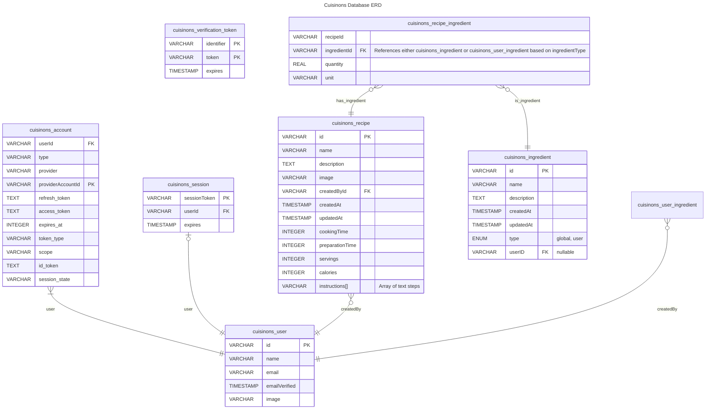

```mermaid
---
title: Cuisinons Database ERD
---
erDiagram
    cuisinons_user {
        VARCHAR id PK
        VARCHAR name
        VARCHAR email
        TIMESTAMP emailVerified
        VARCHAR image
    }
    cuisinons_account {
        VARCHAR userId FK
        VARCHAR type
        VARCHAR provider
        VARCHAR providerAccountId PK
        TEXT refresh_token
        TEXT access_token
        INTEGER expires_at
        VARCHAR token_type
        VARCHAR scope
        TEXT id_token
        VARCHAR session_state
    }
    cuisinons_session {
        VARCHAR sessionToken PK
        VARCHAR userId FK
        TIMESTAMP expires
    }
    cuisinons_verification_token {
        VARCHAR identifier PK
        VARCHAR token PK
        TIMESTAMP expires
    }
    cuisinons_recipe {
        VARCHAR id PK
        VARCHAR name
        TEXT description
        VARCHAR image
        VARCHAR createdById FK
        TIMESTAMP createdAt
        TIMESTAMP updatedAt
        INTEGER cookingTime
        INTEGER preparationTime
        INTEGER servings
        INTEGER calories
        VARCHAR instructions[] "Array of text steps"
    }

    cuisinons_ingredient {
        VARCHAR id PK
        VARCHAR name
        TEXT description
        TIMESTAMP createdAt
        TIMESTAMP updatedAt
        ENUM type "global, user"
        VARCHAR userID FK "nullable"
    }

    cuisinons_recipe_ingredient {
        VARCHAR recipeId
        VARCHAR ingredientId FK "References either cuisinons_ingredient or cuisinons_user_ingredient based on ingredientType"
        REAL quantity
        VARCHAR unit
    }

    cuisinons_account }|--|| cuisinons_user : user
    cuisinons_session |o--|| cuisinons_user : user
    cuisinons_recipe }o--|| cuisinons_user : createdBy
    cuisinons_user_ingredient }o--|| cuisinons_user: createdBy
    cuisinons_recipe_ingredient }o--|| cuisinons_recipe : has_ingredient
    cuisinons_recipe_ingredient }o--|| cuisinons_ingredient : is_ingredient

```
